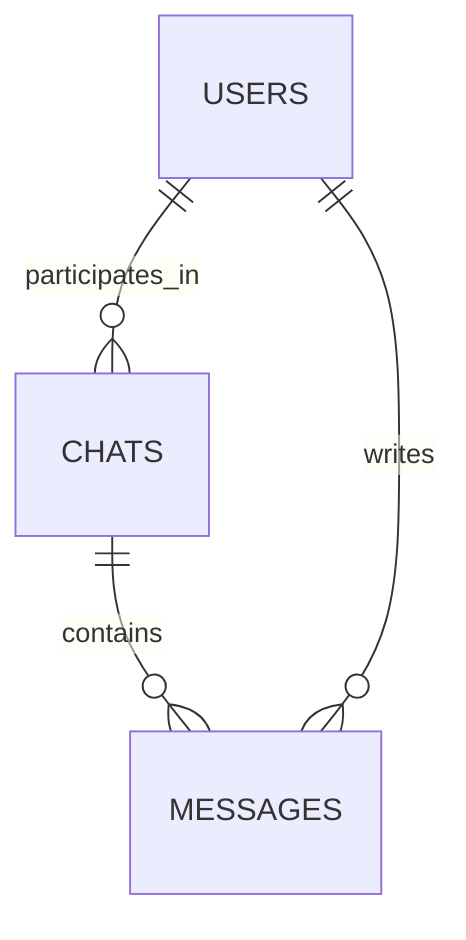

# ER-диаграмма

Базовые сущности системы и их связи.

## Описание сущностей

- **USERS** — пользователи Telegram.
- **CHATS** — чаты или каналы, в которых происходит общение.
- **MESSAGES** — сообщения, создаваемые пользователями в рамках чатов.
